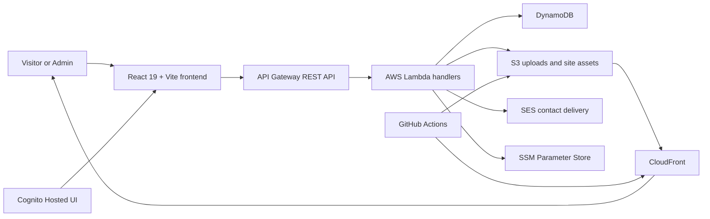

# Portfolio Platform

Production-style personal portfolio platform with a public React site, a Cognito-protected admin CMS, AWS-backed content APIs, GitHub Actions deployment, SES contact delivery, operations telemetry, and an exported AWS recovery snapshot.

Live site: [lucifernewstar-2006.xyz](https://lucifernewstar-2006.xyz)

## Resume-Ready Snapshot

- Architecture: serverless AWS platform with a React/Vite frontend
- Delivery: GitHub Actions CI/CD with optional SonarQube quality gate wiring
- Operations: admin-triggered deploys, public ops summary, richer admin ops insights
- Security posture: Cognito-protected admin, SSM-backed GitHub token lookup, allowlisted CORS on browser-facing admin/contact flows
- Status on `2026-05-15`: `frontend/` lint, build, and production dependency audit all pass locally



## What This Repo Contains

- `frontend/`: active Vite + React application
- `backend/lambdas/`: Lambda source plus SAM-style templates for key handlers
- `backend/api-gateway/`: exported API Gateway definition
- `backend/aws-backups/2026-04-08/`: AWS state backup snapshot used for restore/reference
- `docs/`: full rebuild blueprint, architecture notes, risk history, visual effects catalog, and setup guides

Important note: the root-level `src/` folder is an older stub and is not the production app. The real website lives in `frontend/src/`.

## Current Capabilities

- Public pages: Home, About, Skills, Projects, Experience, Certifications, Posts, Contact, DevOps Lab
- Hidden admin route: `/lucifer-newstar_dashboard`
- Admin CRUD flows for skills, projects, experience, certifications, and posts
- Draft and saved content editing backed by `site_content`
- Admin image upload pipeline to `images/uploads/` in S3
- Admin-triggered production deploy through GitHub Actions
- Public ops summary plus richer admin ops insights
- Contact form delivery through SES
- Theme-aware motion and visual effects system across light and dark modes

## Tech Stack

- Frontend: React 19, Vite 5, React Router 7, GSAP, Three.js, `@react-three/fiber`, `@react-three/drei`
- Backend: AWS Lambda, API Gateway REST API, DynamoDB, Cognito Hosted UI, S3, CloudFront, Route 53, ACM, SES, SSM Parameter Store, WAF
- Delivery: GitHub Actions CI + deploy workflow

## Local Development

### Prerequisites

- Node.js `22` for the frontend workflow
- npm

### Start the active app

```bash
cd frontend
npm ci --legacy-peer-deps
npm run dev
```

Important note: the root-level `src/` folder is an older stub and is not the production app. The real website lives in `frontend/src/`.

### Recommended frontend env

```env
VITE_API_BASE_URL=https://6e2n1oy6k9.execute-api.us-east-1.amazonaws.com/prod
VITE_COGNITO_DOMAIN=https://us-east-1iwnapdbk8.auth.us-east-1.amazoncognito.com
VITE_COGNITO_CLIENT_ID=2kqig6fjtjb5rot22ccttr398n
VITE_COGNITO_REDIRECT_URI=https://lucifernewstar-2006.xyz/callback
VITE_COGNITO_SCOPE=openid email phone
```

The app has fallback values in code for the current live environment, but explicit env values are still the safer rebuild path.

## Verification Commands

```bash
cd frontend
npm run lint
npm run build
npm audit --omit=dev
```

## SonarQube

The CI workflow is prepared for an optional repo-level SonarQube quality gate. It analyzes:

- `frontend/src/`
- `backend/lambdas/**/src/`

Enable it in GitHub repository settings with:

- Secret: `SONAR_TOKEN`
- Variable: `SONAR_HOST_URL`
- Variable: `SONAR_PROJECT_KEY`

If those values are not configured, the SonarQube step is skipped and the rest of CI still runs normally.

The scan configuration lives in [sonar-project.properties](/D:/navin/Resume%20and%20Portfolio/portfolio/sonar-project.properties).

Current local verification status on `2026-05-15`:

- `npm run lint`: passed
- `npm run build`: passed
- `npm audit --omit=dev`: passed
- Build warning still present: large frontend bundle chunks remain, especially around the `three`-heavy visual stack

## Security And Operations

- Admin authentication uses Cognito Hosted UI plus PKCE and token-backed protected routes.
- Admin-triggered deploys fetch the GitHub PAT from SSM path `/portfolio/github/token` instead of storing plaintext tokens in Lambda env vars.
- Browser-facing admin/content/contact handlers use allowlisted CORS instead of wildcard browser access.
- Content saves strip embedded `data:image/...` payloads before upload and persist large content through chunked `site_content` records in DynamoDB.
- Production deploy syncs must keep `images/uploads/*` excluded from destructive S3 deletes.

## Ship Checklist

- Run the active app from `frontend/`, not the legacy root `src/`.
- Keep the project description centered on React/Vite, AWS serverless services, GitHub Actions CI/CD, observability, and optional SonarQube.
- Do not claim `Docker`, `Kubernetes`, or `microservices` unless they are actually implemented and used in this repo.
- Finish one manual live-environment pass for auth, save, upload, deploy, contact, and ops flows before calling the site fully signed off.

## Deployment Flow

1. Admin dashboard calls `POST /admin/deploy`.
2. `deploy-website` validates the admin token.
3. GitHub PAT is fetched from SSM path `/portfolio/github/token`.
4. GitHub Actions `deploy.yml` runs build + S3 sync + CloudFront invalidation.
5. Upload safety rule keeps `images/uploads/*` from being deleted during deploy.

## AWS Backup Coverage

Repo backup snapshot: `backend/aws-backups/2026-04-08/`

Included:

- Lambda configs and downloaded ZIPs
- API Gateway exports and stage data
- DynamoDB schema and table scans
- Cognito pool and client metadata
- CloudFront config and invalidations
- S3 settings and bucket sync
- Route 53, ACM, SES, IAM, WAF, and SSM metadata

Safety note:

- the repo copy of `describe-user-pool-client.json` has had `ClientSecret` redacted
- the SSM metadata file still contains encrypted SecureString ciphertext, not a decrypted secret
- if a full-forensics backup is needed, keep the unredacted version outside the public repo

## Documentation Map

Start here:

1. `docs/DOCS-INDEX.md`
2. `docs/MASTER-DOC.md`
3. `docs/INFRASTRUCTURE-REBUILD-PLAYBOOK.md`
4. `docs/SHIP-READINESS-CHECKLIST.md`

Specialized references:

- `docs/VISUAL-EFFECTS-CATALOG.md`
- `docs/CRITICAL-ISSUES-WARNINGS-AND-PRECAUTIONS.md`
- `docs/admin-content-and-deploy-api-setup.md`
- `docs/contact-email-setup.md`

## Current Review Notes

- Contact and site-content CORS handling were aligned to allowlisted origins during this pass.
- Frontend Cognito fallback client ID was aligned with the live backup snapshot during this pass.
- No automated end-to-end click-through tests exist in the repo, so cross-page/button/theme validation is still partially manual.
